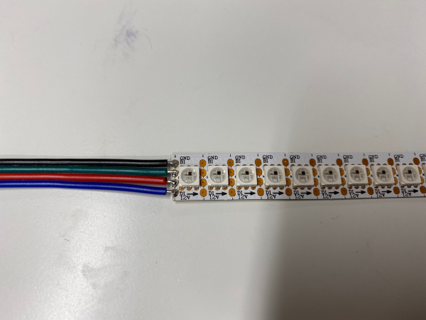
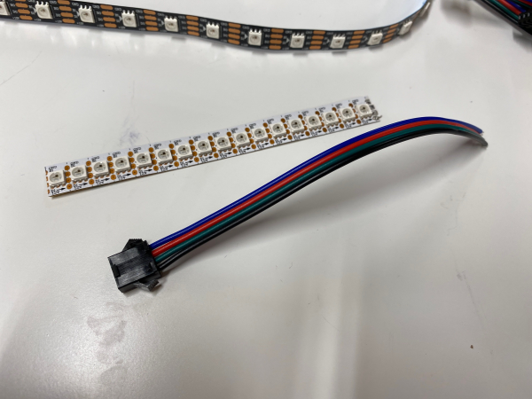
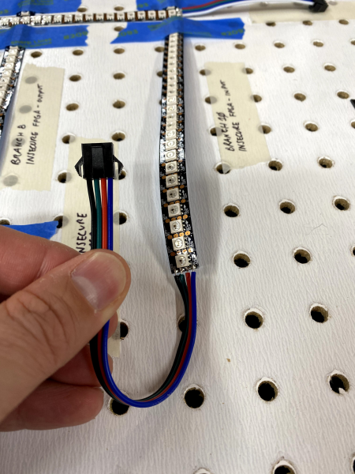
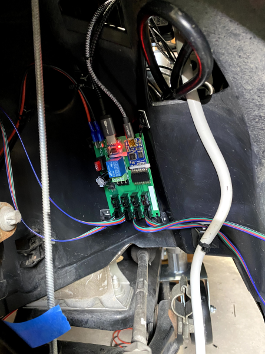

# Introduction
The LED String Manager Board is a Fadecandy-based LED string manager solution which provides a tidy, robust power and data solution for strings of individually addressable 12 volt LEDs commonly referred to as Neopixels.

Up to eight strings of 63 LEDs can be driven using this board. A Fadecandy board and a USB relay are necessary.

Schematic and Board were created using Eagle 9.6.2 Premium. The following design artifacts are included in this repository:
- Schematic and Board Layout files
- Bill of Materials
- Gerber files

# LED String Interface
Each LED string _requires_ three circuits:
- 12 volts (Blue)
- Data (Red)
- Ground (Black)

There is a second, backup data line which is not used.

Each LED string is terminated in a JST P/N SMP-04V-BC connector as shown in the following image.

Any 100 mil spaced male header may be used for LED string connections at CN2 through CN9. The boards in the CyberPhysical demonstrator use Molex P/N 0901361204, which is a shrouded header with a key clip. Each four circuit harness used in the CyberPhysical demonstrator consists of the following:

1 x Molex P/N 0901560144 (housing)
4 x Molex P/N 0901192109 (crimp contacts, requires Molex Crimp Tool P/N 0638258100)
Varied length of 4-circuit LED extension wire
1 x JST P/N SMR-04V-B (housing)
4 x JST P/N SYM-001T-P0.6(N) (crimp contacts)

Pin #1 of the Molex connector is 12 volts (Blue).

# Example Installation
The following image shows an LED String Manager Board installed in the CyberPhysical demonstrator with variable length LED string interface harnesses.

