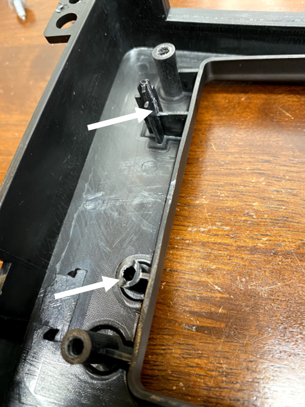
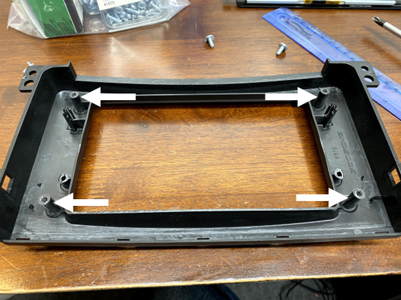
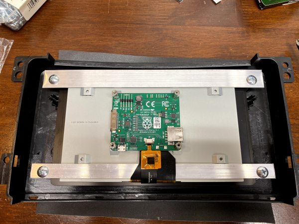
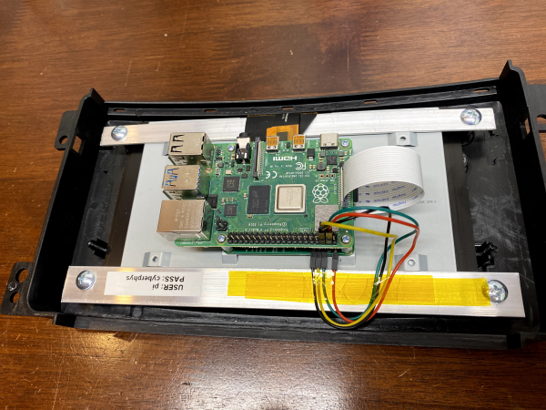
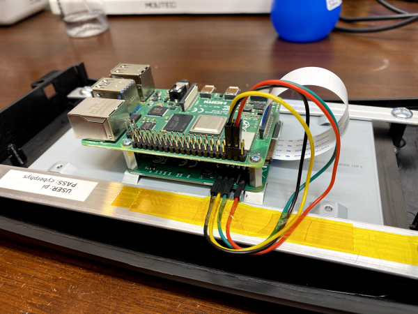
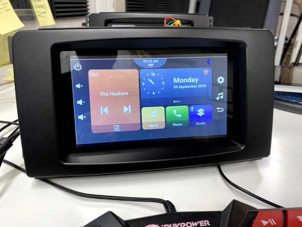

# Introduction
The CyberPhysical Demonstrator Infotainment assembly, in the most basic sense, consists of a Raspberry Pi with Touchscreen mounted to an off-the-shelf double DIN bezel made for a Smart Fortwo

# Bill of Materials
The following table is the parts necessary to build the assembly described in this readme.

Line # | Component Description | Manufacturer | Manufacturer P/N | Vendor | Vendor P/N | Qty
------ | --------------------- | ------------ | ---------------- | ------ | ---------- | ---
1 | Raspberry Pi 4 Model B, 4 GB | Raspberry Pi Foundation | RAS-4-4G | Amazon | B07TC2BK1X | 1
2 | MicroSD Card >= 16 GB | you pick | >>>>> | >>>>> | >>>>> | 1
3 | Raspberry Pi 7 inch Touchscreen Display | Raspberry Pi Foundation | 7TOUCH | Amazon | B0153R2A9I | 1
4 | Double DIN Bezel Dash Kit (includes screws) | Scosche | ST2430B | Amazon | B001EBOQBS | 1
5 | Aluminum bar, 3/4" wide x 1/16" thick <custom>| you pick | >>>>> | >>>>> | >>>>> | see drawing below
6 | Aluminum bar, 1/2" wide x 1/16" thick <custom> | you pick | >>>>> | >>>>> | >>>>> | see drawing below
7 | Polyamide tape, 1/2" wide | you pick | >>>>> | >>>>> | >>>>> | as needed

It is necessary to sand down the shorter sides of the touchscreen to make it fit in between the posts of the double DIN bezel kit. Wet sanding with 80, 150, and finally 220 grit is fast and effective.

Use glass cleaner and residue free cleaning wipes to keep the touchscreen clean.

# Basic Assembly Instructions
The following numbered list is a basic step-by-step process to build one of these infotainment assemblies. There are pictures shown below which illustrate important details necessary to complete the assembly.
1. Sand down touchscreen
1. Trim double DIN bezel kit
1. Cut and fabricate aluminum bars
1. Position 1/2" wide aluminum bar into display
1. Place touchscreen into bezel
1. Position 3/4" wide aluminum bar onto display
1. Affix aluminum bars into place with screws provided in Scosche kit
1. Install flat flexible cable into display control board
1. Install touchscreen power, ground, and I2C jumper wires onto display control board
1. Install Raspberry Pi 4 over LCD control board
1. Insert imaged microSD card into Raspberry Pi slot
1. Connect display flat flex cable to Raspberry Pi
1. Connect touchscreen power, ground, and I2C jumper wires to Raspberry Pi
1. Apply power through USB-C and follow onscreen setup instructions

# Aluminum Mounting Bar Dimensions
See the attached file for reference.
[Aluminum Mounting Bars Diagram](GALOIS_CYBERPHYSICAL_INFOTAINMENT_ALUMINUM_MOUNTING_BARS.PDF)

# Assembly Pictures
### Plastic Double DIN Bezel Trim Points
Trim the areas shown in the following image on the left _and_ right sides of the bezel. A set of end nipper pliers works well for trimming down the mounting boss. Flush cutters work well for the other cut.

### Plastic Double DIN Bezel Touchscreen Glass Width Constraining Mounting Bosses
The following image shows the width constraining mounting bosses with white arrows. _The LCD's touch glass must be sanded down to accommodate this width_.

### Double DIN Bezel with Touchscreen and Aluminum Bars with Fasteners
The following image shows the aluminum bars. The 3/4 inch wide bar is on top. The 1/2 inch wide bar is on the bottom. Note that the 1/2 inch bar is inserted between the orange and black flat flexible cabling and the back of the LCD.

### Raspberry Pi Installed and Attached to Display Control Board

### Touchscreen Power, Ground, and I2C Hook Up

### Infotainment Assembly with Mock Up Image

