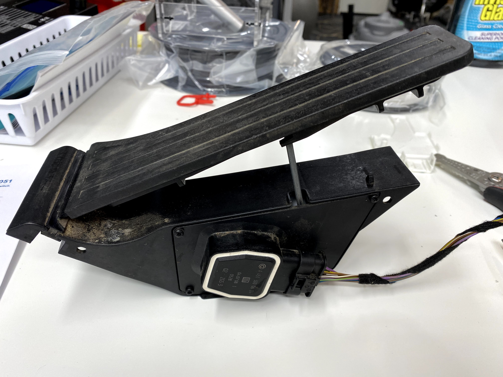
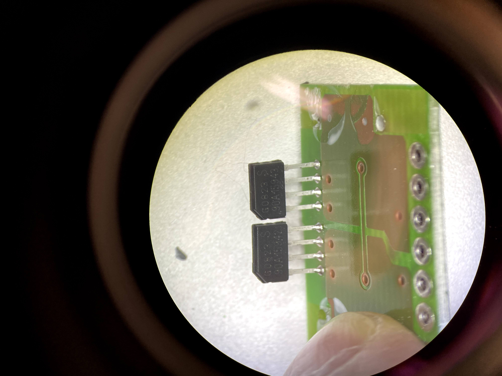

# Configuration Details
P/N is A 451 300 06 04

# Basic Operation
The Smart Fortwo pedal rotates a spring loaded plastic housing inside of the pedal assembly. There’s a ring magnet that rotates around a set of magnetic position sensors. The position sensors output an analog voltage.
# Wire Harness
The following table maps wire harness colors to functions:

Pin Number | Wire Color | Function
---------- | ---------- | --------
1 | Blue with brown stripe | +5 volts (sensor #1 + #2 bias)
2 | Violet with green stripe | Sensor #1 output
3 | Brown with white stripe | Sensor #1 ground
4 | Brown with yellow stripe | Sensor #2 ground
5 | Not connected | n/a
6 | Violet with yellow stripe | Sensor #2 output
# Sensor Characteristics
There are two sensors in the gas pedal assembly. 

The following tables contain observational data on voltage vs pedal position for each sensor.
## Sensor #1
Bias | Idle Voltage | Full Throttle Voltage
---- | ------------ | ---------------------
+5V | 320 mV | 4240 mV
+3.3V | 200 mV | 2900 mV

## Sensor #2
Bias | Idle Voltage | Full Throttle Voltage
---- | ------------ | ---------------------
+5V | 160 mV | 2125 mV
+3.3V | 100 mV | 1467 mV
