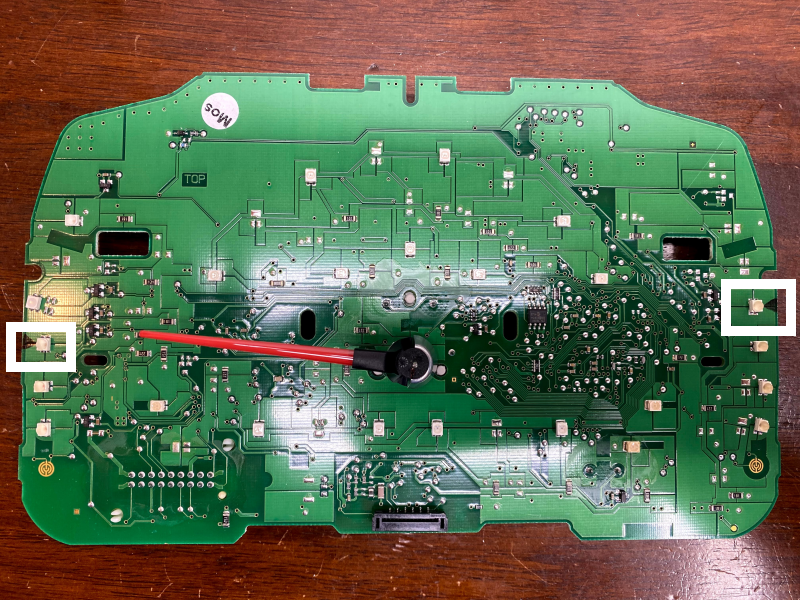
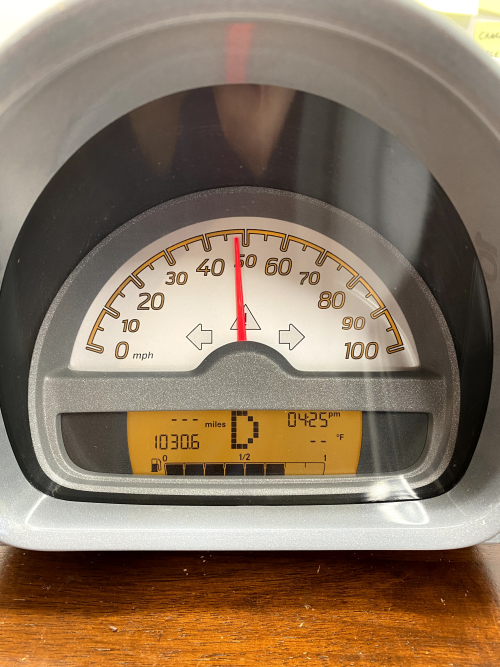

# Introduction
The Smart Fortwo's instrument cluster assembly displays a variety of information, most of which is sourced from the CAN bus in the vehicle. A recent datalog showed approximately 30 unique message identifiers on the bus, but only a handful are required to actuate the speedometer needle, fuel level indiciator, and the warning lights indicators.

# Overview

Instrument Cluster Diagram from (Smart Fortwo Quick Guide)[https://www.smartusa.com/resources/downloads/manuals/2008/quick_guide.pdf].

## Instrument Cluster Key
1. Button to select display for status indicator. Also used for setting the digital clock.
1. Left side indicator lamp display with:
   1. Low beam headlamp indicator
   1. High beam headlamp indicator
   1. Combination low tire pressure/TPMS malfunction telltale
   1. Seat belt telltale
   1. SRS indicator lamp
1. Left turn signal indicator lamp
1. ESP warning lamp
1. Right turn signal indicator lamp
1. Speedometer
1. Right side indicator lamp display with:
   1. EPS warning lamp
   1. Engine malfunction indicator lamp
   1. ABS indicator lamp
   1. Brake warning lamp
1. Button for adjusting instrument cluster illumination. Also used for setting digital clock.
1. Right center indicator lamp display with:
   1. Engine oil pressure indicator lamp
   1. Coolant temperature warning lamp
1. Multifunction display with:
   1. Fuel level display
   1. Transmission position indicator
   1. Main odometer display or when active distance to next maintenance service
   1. Digital clock
   1. Outside temperature display
1. Status indicator with:
   1. Trip odometer display
   1. Maintenance service interval display
   1. Reserve fuel indicator
1. Left center indicator lamp display with:
   1. Battery indicator lamp

# Pinout
The following pins must be connected for minimum viable functionality.
Pin # | Wire Harness Color | Function
----- | ------------------ | --------
1 | Red with white stripe | Power (12 volts)
2 | Brown | Ground
5 | Green with white stripe | CAN H
8 | Green | CAN L

# Hardware Modifications
The LEDs associated with the warning lamps for TPMS and ESC (the steering wheel with the exclamation point) must be removed. These LEDs are show in white boxes.

# CAN Bus Messages for Activating and Controlling the Instrument Cluster

As previously mentioned, there are a handful of messages necessary to activate the instrument cluster. The following table contains the CAN IDs, lengths, and functions of these messages. Messaging sent at a rate of 50 Hz results in reasonable behavior, so send messages at 50 Hz. Experimentation with faster or slower rates is not out of the question, but may not be necessary.

Since this is a reverse engineering effort and there are many bit and value combinations contained on the CAN bus, the functions of some bytes remain unknown.

CAN ID | Length | Information 
------ | ------ | -----------
0x423 | 7 | Main instrument cluster activation packet; instrument cluster _will not function_ without this message
0x1E1 | 8 | Seat belt sensor, SRS airbag sensor
0x200 | 8 | Parking brake, indicated speed
0x210 | 8 | TPMS?
0x308 | 8 | Battery, oil, coolant, check engine light, and fuel level sensor
0x418 | 8 | Transmission gear selection

## Message 0x423, Length = 7
"X" denotes don't care _or_ contents make no observable difference in behavior.

Byte | BIT 7 | BIT 6 | BIT 5 | BIT 4 | BIT 3 | BIT 2 | BIT 1 | BIT 0
---- | ----- | ----- | ----- | ----- | ----- | ----- | ----- | -----
D0 | X | X | X | X | X | X | X | KEY (1 = inserted, running)
D1 | CABRIO ROOF STATUS* (1 = insecure, 0 = OK) | X | X | X | PARKING LIGHTS STATUS? (1 = ON, 0 = OFF) | HIGH BEAM (1 = ON, 0 = OFF) | LEFT TURN SIGNAL (1 = ON, 0 = OFF) | RIGHT TURN SIGNAL (1 = ON, 0 = OFF)
D2 | X | X | X | X | X | X | X | X 
D3 | X | X | X | X | X | X | SPEEDOMETER NUMBER B/L (1 = ON, 0 = OFF) | LOW BEAM (1 = ON, 0 = OFF)
D4 | X | X | X | X | X | X | X | X
D5 | X | X | X | X | X | X | X | X
D6 | X | X | X | X | X | X | X | X

For example, transmitting this message at 50 Hz:

0x423, 7, 0x01, 0x08, 0x00, 0x02, 0x00, 0x00, 0x00

Put the instrument cluster in the following state:
* Key in ignition and car in run mode
* Speedometer numbers and needle backlights on
* Multifunction display active

*The cabrio roof status was an accidental discovery.

## Message 0x1E1, Length = 8
Transmitting the following message clears the seat belt and SRS airbag sensor errors:

ID | DLC | D0 | D1 | D2 | D3 | D4 | D5 | D6 | D7
-- | --- | -- | -- | -- | -- | -- | -- | -- | --
0x1E1 | 8 | 0x00 | 0x00 | 0x00 | 0x00 | 0x00 | 0x00 | 0x00 | 0x00

D0 byte contains SRS information; all zeroes indicates SRS system is functional

D1 byte contains seat belt sensor information; all zeroes indicates seat belts are in use

## Message 0x200, Length = 8
This message contains data to command the instrument cluster to point the speedometer needle at an indicated speed. The car has multiple wheel speed sensors, which are represented in the packet.

Data format:
* Data specifies the set point in stepper motor steps.
* Minimum: 0 steps
* Maximum: undefined, but the instrument cluster maxes out at 100 miles per hour, which seems to be 2952 steps.
* Sensitivity: 29.52 steps/mph

"X" denotes don't care _or_ contents make no observable difference in behavior.

ID | DLC | D0 | D1 | D2 | D3 | D4 | D5 | D6 | D7
-- | --- | -- | -- | -- | -- | -- | -- | -- | --
0x200| 8 | 0x00 - off, 0x02 - parking brake, 0x04 - ABS, 0x20 ESP flashing | X | SPEED SENSOR A HIGH BYTE | SPEED SENSOR A LOW BYTE | SPEED SENSOR B HIGH BYTE | SPEED SENSOR B LOW BYTE | SPEED SENSOR C HIGH BYTE | SPEED SENSOR C LOW BYTE

### Conversion Meters per Second to Steps
1. Convert meters per second to miles per hour. (m/s x 2.23694 mph/m/s)
1. Convert miles per hour to steps. (mph x 29.52 steps/mph)
1. Convert float steps to int steps.
1. Store high byte in D2.
1. Store low byte in D3.

### Examples

#### 14.6 miles per hour
ID | DLC | D0 | D1 | D2 | D3 | D4 | D5 | D6 | D7
-- | --- | -- | -- | -- | -- | -- | -- | -- | --
0x200 | 8 | X | X | 0x01 | 0xAE | 0x00 | 0x00 | 0x00 | 0x00

#### 47.8 miles per hour
ID | DLC | D0 | D1 | D2 | D3 | D4 | D5 | D6 | D7
-- | --- | -- | -- | -- | -- | -- | -- | -- | --
0x200 | 8 | X | X | 0x05 | 0x83 | 0x00 | 0x00 | 0x00 | 0x00

### 82.5 miles per hour
ID | DLC | D0 | D1 | D2 | D3 | D4 | D5 | D6 | D7
-- | --- | -- | -- | -- | -- | -- | -- | -- | --
0x200 | 8 | X | X | 0x09 | 0x83 | 0x00 | 0x00 | 0x00 | 0x00

## Message 0x210, Length = 8
Transmitting the following message clears most sensor errors and must be present:

ID | DLC | D0 | D1 | D2 | D3 | D4 | D5 | D6 | D7
-- | --- | -- | -- | -- | -- | -- | -- | -- | --
0x210 | 8 | 0x00 | 0x00 | 0x00 | 0x40 | 0x00 | 0x00 | 0x00 | 0x00

## Message 0x308, Length = 8
This message contains data to control warning lamps for the check engine, oil pressure, and battery. It also contains the fuel level.

ID | DLC | D0 | D1 | D2 | D3 | D4 | D5 | D6 | D7
-- | --- | -- | -- | -- | -- | -- | -- | -- | --
0x308 | 8 | 0x00 | 0x00 | 0x02 = CEL, 0x04 = Oil, 0x20 = Battery | 0x00 | 0x00 | 0x00 | Fuel, high byte | Fuel, low byte

### Fuel Level Formula
The following formula is based on empirical observations and results in reasonable fuel levels. Some notes:
* The Smart Fortwo's fuel tank has a capacity of 8.7 gallons
* Maximum fuel level is at D6: 0x01, D7: 0x35 (decimal 309, which will be used an offset from full)
* Minimum fuel level is at D6: 0x02, D7: 0xFF (decimal 767)
* There are 52.64 tics/gallon (maximum - minimum) / capacity

As fuel is consumed, the value we send to the instrument cluster _increases_.

((Gallons(capacity) - Gallons(remaining)) x 52.64 tics/gallon) + 309

At 6.2 remaining gallons:
((8.7 gallons - 6.2 gallons) x 52.64 tics/gallon) + 309 tics = 440.6
Round up to 441 tics.
441 tics in hex is 0x01B9
Split into high and low bytes:
0x01, 0xB9

### Fuel Level Examples

#### Full (8/8 ticks)
ID | DLC | D0 | D1 | D2 | D3 | D4 | D5 | D6 | D7
-- | --- | -- | -- | -- | -- | -- | -- | -- | --
0x308 | 8 | X | X | X | X | X | X | 0x01 | 0x35 to 0x73

#### 7/8 Full
ID | DLC | D0 | D1 | D2 | D3 | D4 | D5 | D6 | D7
-- | --- | -- | -- | -- | -- | -- | -- | -- | --
0x308 | 8 | X | X | X | X | X | X | 0x01 | 0x74 to 0x9E

#### 6/8 Full
ID | DLC | D0 | D1 | D2 | D3 | D4 | D5 | D6 | D7
-- | --- | -- | -- | -- | -- | -- | -- | -- | --
0x308 | 8 | X | X | X | X | X | X | 0x01 | 0x9F to 0xD8

#### 5/8 Full
ID | DLC | D0 | D1 | D2 | D3 | D4 | D5 | D6 | D7
-- | --- | -- | -- | -- | -- | -- | -- | -- | --
0x308 | 8 | X | X | X | X | X | X | 0x01 | 0xD9 to 0xFF

#### 4/8 Full
ID | DLC | D0 | D1 | D2 | D3 | D4 | D5 | D6 | D7
-- | --- | -- | -- | -- | -- | -- | -- | -- | --
0x308 | 8 | X | X | X | X | X | X | 0x02 | 0x0F to 0x43

#### 3/8 Full
ID | DLC | D0 | D1 | D2 | D3 | D4 | D5 | D6 | D7
-- | --- | -- | -- | -- | -- | -- | -- | -- | --
0x308 | 8 | X | X | X | X | X | X | 0x02 | 0x44 to 0x75

#### 2/8 Full
ID | DLC | D0 | D1 | D2 | D3 | D4 | D5 | D6 | D7
-- | --- | -- | -- | -- | -- | -- | -- | -- | --
0x308 | 8 | X | X | X | X | X | X | 0x02 | 0x76 to 0xA9

#### 1/8 Full
ID | DLC | D0 | D1 | D2 | D3 | D4 | D5 | D6 | D7
-- | --- | -- | -- | -- | -- | -- | -- | -- | --
0x308 | 8 | X | X | X | X | X | X | 0x02 | 0xAA to 0xDF

#### 0/8 Full
ID | DLC | D0 | D1 | D2 | D3 | D4 | D5 | D6 | D7
-- | --- | -- | -- | -- | -- | -- | -- | -- | --
0x308 | 8 | X | X | X | X | X | X | 0x02 | 0xE0 to 0xFF

## Message 0x418, Length = 8
This message contains data to control the gear selection character on the multifunctional display.
ID | DLC | D0 | D1 | D2 | D3 | D4 | D5 | D6 | D7
-- | --- | -- | -- | -- | -- | -- | -- | -- | --
0x418 | 8 | gear | X | X | X | X | X | X | X

Where gear is one of the following:
Mode | Value
---- | -----
P | 0x50
R | 0x52
N | 0x4E
D | 0x0B
1 | 0x31
2 | 0x32
3 | 0x33
4 | 0x34
5 | 0x35
