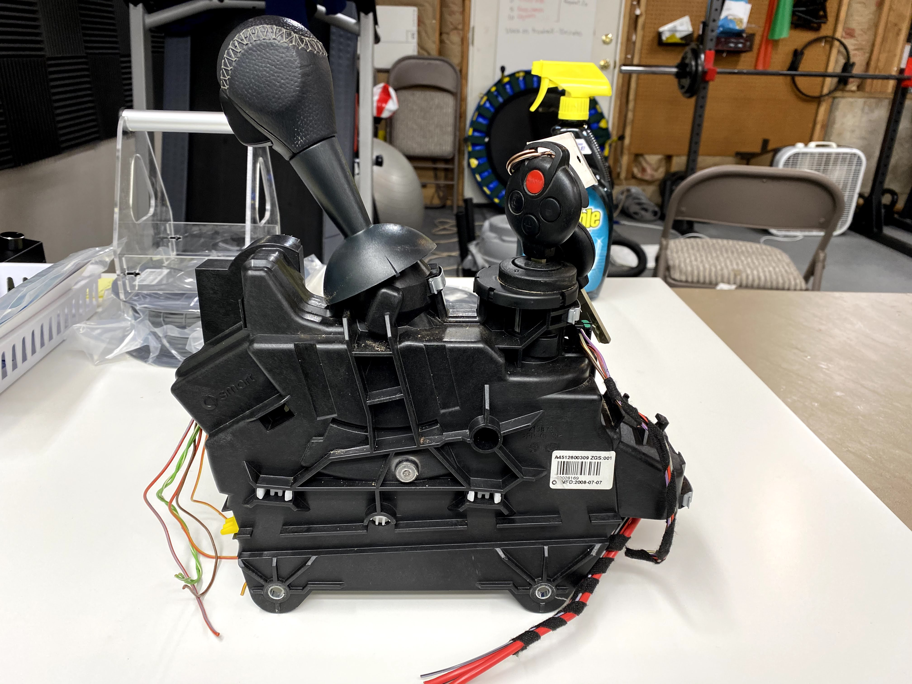
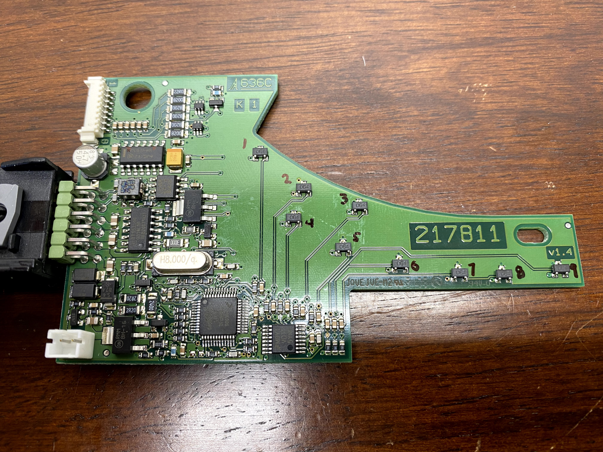
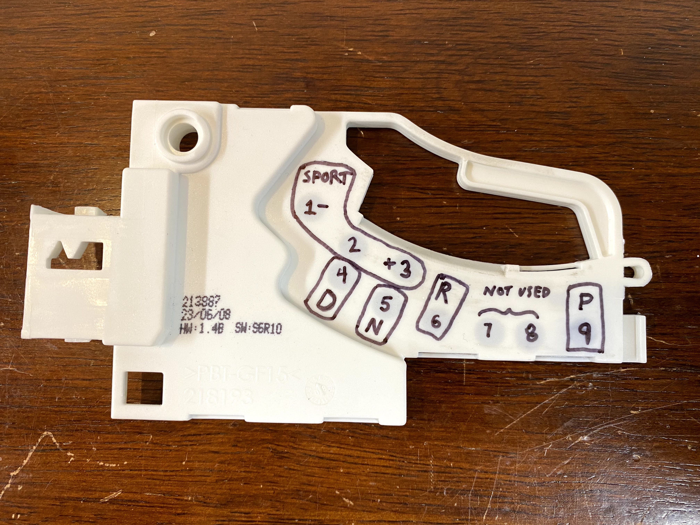
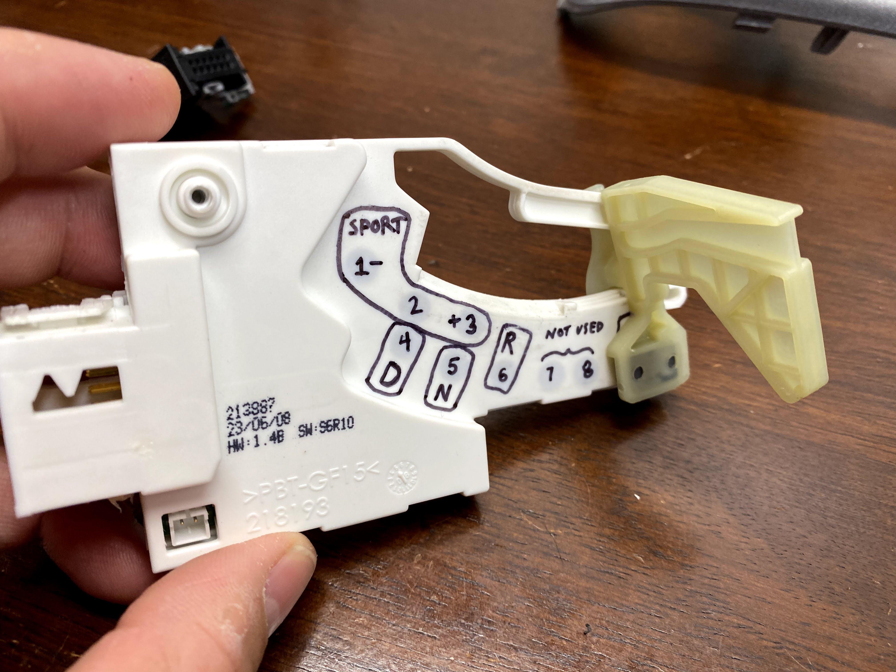

# Introduction

The Smart Fortwo gear selector electromechanical assembly has the following functions and features:
- Solenoid lockout
- Ignition lockout
- Ignition security module
- Gear shifter cradle
- Gear shifter lever with button
- Gear selection LED indicator
- Cabrio rooftop up/down controls
- Useless little slot-style coin holder
- Brake cable actuator

# Wire Harness
Pin # | Color | Function
----- | ----- | --------
1 | Red / Gray Stripe | 12 volts DC
2 | Red / Yellow Stripe | not used for CyberPhysical Demonstrator
3 | Brown | Ground
4 | Yellow / Red Stripe | not used for CyberPhysical Demonstrator
5 | Green / White Stripe | CAN_H
6 | Green | CAN_L

# Gear Selection Sensing Operation
The Smart Fortwo gear selector assembly utilizes a set of magnetic proximity sensors and a small magnet which travels along with the gear shift lever to detect which state the user has chosen. There are more proximity sensors than available gears which suggests this printed circuit board assembly is used in more than one model.

# Start Up Procedure
The Smart Fortwo gear selector control and sensing PCBA starts up and broadcasts CAN packets when power is applied through its wire harness. The LED gear selection indicator also works and indicates which gear is chosen.

# CAN BUS Packet Observations
CAN Bus packets observed and logged with [Microchip CAN BUS Analyzer.](https://www.microchip.com/DevelopmentTools/ProductDetails/PartNO/APGDT002)

Gear Selection | ID | DLC | DATA0 | DATA1 | DATA2
-------------- | -- | --- | ----- | ----- | -----
Undetermined | 0x230 | 3 | 0x61 | varies | varies
P | 0x230 | 3 | 0x28 | 0x*0 | 0x*7
R | 0x230 | 3 | 0x27 | 0x*0 | 0x*8
N | 0x230 | 3 | 0x26 | 0x*0 | 0x*9
D | 0x230 | 3 | 0x25 | 0x*0 | 0x*A
MANUAL | 0x230 | 3 | 0x23 | 0x*0 | 0x*C
MANUAL + | 0x230 | 3 | 0x29 | 0x*0 | 0x*6
MANUAL - | 0x230 | 3 | 0x2A | 0x*0 | 0x*5

# Modification for Use in CyberPhysical Demonstrator
The gear selector assembly was modified to accommodate a simulator without a complex automotive electromechanical control system. Given this, the user should just be able to insert the key into the ignition, turn it to "ON" or "RUN", and be able to shift the car from P into gear. Thus, the following were deleted or removed from the shifter assembly:
- Delete solenoid lockout mechanism
- Delete brake cable lockout mechanism
- Delete ignition security module functionality (leave assembly in place)
- Sense ignition module as an electronic switch as it could enable further functionality to mimic a car.
