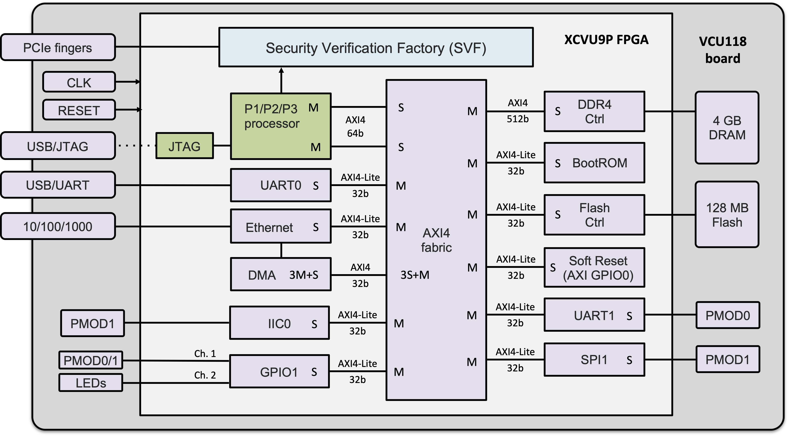

# Targets/Backends #

In this document, we explain in more details the different supported targets/backends and their setup requirements.

---

## Implementation ##

The target base class is `commonTarget` and is defined in [common.py](../../besspin/target/common.py). This class implements the methods that are shared among all types of backends, and depends on defining the lower level methods in backend-specific classes. There is also an `fpgaTarget` class (defined in [fpga.py](../../besspin/target/fpga.py)) that has the methods related to having an FPGA, like openining an OpenOCD connection, and starting a GDB process. 

For any target choice, which are `vcu118`, `qemu`, `awsf1`, there is a class that defines the lowest level methods. The `vcu118Target` class, for instance, inherits both `fpgaTarget` and `commonTarget`. While `qemuTarget` only inherits `commonTarget`.

---

## QEMU ##

The Nix shell has an installed `qemu-system-riscv64` and the tool uses it to start a Qemu process and interacts with it using `pexpect`. There are no special setup requirements for Qemu, except for having enough memory to start it.

For Unix OSes, we need to have a network access to the Qemu target. The tool creates a tap adaptor, and adds a virtual network device to the Qemu. This requires sudo privileges. Please note that ticket #975 is a feature request for adding a setting to the tool that chooses to use TCP forwarding instead of a TAP adaptor, which would remove the sudo requirement for some modes.

It is worth mentioning that currently, the tool's default FreeBSD does not have an entropy source. Ticket #333 is open to resolve this. On the other hand, Debian seems to use `virtio-rng-device` properly without any extra setup.

---

## VCU118 ##

### Setup ###

A Xilinx VCU118 FPGA should be accessible, in addition to executing all the [GFE setup instructions](https://https://github.com/GaloisInc/BESSPIN-GFE/tree/develop).   

Note that the name of the ethernet adaptor connected to the VCU118 might change from a system to another. Please review the [FPGA host network configuration setup instructions](#network-setup) for more details about the adaptors and IP settings. In case you intend to use a different setup, please change [setupEnv.json](../../besspin/base/utils/setupEnv.json) accordingly.

### Design ###

The SSITH GFE SoC, a block diagram of which is shown below, is designed to run in emulation on a Xilinx VCU118 Virtex UltraScale+ FPGA development board. The VCU118 was chosen for its high programmable logic capacity, as the SSITH modifications to the RISC-V processors must be able to run within the GFE SoC despite having (in some cases significant) additional logic.



The VCU118 includes 4 GB of RAM, a 128MB flash memory, an Ethernet interface, several general I/O interfaces, and a PCIe interface, enabling the SSITH GFE SoCs to act as full-fledged, albeit slow (the emulated CPUs run at approximately 100MHz), computing systems. In addition to allowing the execution of *bare metal* RISC-V binaries with no operating system, the two 32-bit microcontroller versions of the SoC support the FreeRTOS operating system; the four 64-bit versions of the SoC support the Linux and FreeBSD operating systems as well.

### Tool Flow ###

- The files needed are the bit file, and if not used in flash mode, then a probe file is needed too.
- The tool resets the ethernet adaptor, then programs the FPGA with the bit file (more details about the VCU118 modes are in [configuration.md](./configuration.md)). 
- The tool then connects to the target using openOCD, then starts a GDB session that remotely connects to the target through openOCD. After that, the binary is loaded and the execution is *continued*. The main TTY uses the USB connection to the UART chip on the VCU118 board.

### Network Setup ###

The Linux and FreeRTOS tests expect the host PC to have a specific IP address.
We recommend that you don't connect the VCU118 to your LAN, but instead create
a separate one-cable network between the host and FPGA. These instructions show
how to reproduce the network configuration used by Galois GFE hosts.

We expected the host machine to have a network interface called `eth0fpga` which is
connected to the FPGA and has a fixed IPv4 address of `10.88.88.1`. The FPGA then will have IP of `10.88.88.2`

Because each host machine might have different default names for the ethernet adaptors, we need to rename the proper interface. The best way is to use `crontab` and a custom script.

0. Make sure `macchanger` is installed:
    ```
    sudo apt install macchanger
    ```

1. In this case we have interface `enp2s0` connected to the FPGA. Change the   script accordingly for your machine:

```
#!/bin/bash
OLDNAME=enp2s0
NEWNAME=eth0fpga
ip link set $OLDNAME down
ip link set $OLDNAME name $NEWNAME
ip link set $NEWNAME up
macchanger -m 88:53:48:41:56:45 $NEWNAME
ip addr add 10.88.88.1/24 dev $NEWNAME
```

and save it as `/opt/net_setup.sh`

2. Make executable:
    ```
    sudo chmod +x /opt/net_setup.sh
    ```

3. Edit crontab with:
    ```
    sudo crontab -e
    ```
    andd add:
    ```
    @reboot /opt/net_setup.sh
    ```

4. Check that the command got saved:
    ```
    sudo crontab -l
    # lists all cron jobs
    ...
    @reboot /opt/net_setup.sh
    ...
    ```

5. Reboot your computer. You should now see something like:
    ```
    ip a
    ...
    4: eth0fpga: <BROADCAST,MULTICAST,UP,LOWER_UP> mtu 1500 qdisc pfifo_fast state UP group default qlen 1000
        link/ether 88:53:48:41:56:45 brd ff:ff:ff:ff:ff:ff
        inet 10.88.88.1/24 scope global eth0fpga
    ...
    ```

### Manual Run ###

Here we explain how to run an OS on the VCU118 outside of the tool for any reason. It is worth mentioning that running the tool while enabling `openConsole` and `gdbDebug` can provide what is desired without doing it manually, more information is in [configuration.md](./configuration.md).

You need 3 separate terminal windows/tabs/panes for: OpenOCD, GDB, and TTY.

1. Connect a minicom to the UART. This means you have to know which `/dev/tty` is the one connected to the UART chip of the VCU118 board. The `vcu118UartSettings` in [setupEnv.json](../../besspin/base/utils/setupEnv.json) has some properties that help distinguishing which one. Also, if you have used the tool on the machine before, the `uartDevicesSavedMap` (a git ignored file whose path is stored in [setupEnv.json](../../besspin/base/utils/setupEnv.json)) will have the serial number of the device mapped with the HW ID. Assuming it is `/dev/ttyUSB${X}`, you can use `minicom` (or any similar serial communication tool) as follows:

```bash
    minicom -D /dev/ttyUSB${X} -b 115200
```

Also, note that depending on the OS, and the minicom settings, new lines on minicom might not get printed well in a user friendly way. You can use `ctrl-A o` -> `Screen and Keyboard` -> `T` -> Save setup as default. This will make sure minicom inserts an extra new line and thus you do not need to have `\r\n` for every print in the program. This is very useful for FreeRTOS targets. 

2. Open an openOCD connection. The simplest way would be to use the tool's existing configuration [openocd_vcu118.cfg](../../besspin/target/utils/openocd_vcu118.cfg) as follows:

```bash
    openocd --command "set _CHIPNAME riscv; gdb_port ${PORT}" -f /path/to/openocd_vcu118.cfg
```

3. Open GDB with the OS binary

```bash
    riscv64-unknown-elf-gdb /path/to/binary
```

In the GDB shell, first, you need to connect to the target, reset, then load the file and continue (or do something else):

```bash
    target remote localhost:${PORT}
    set *(0x6fff0000)=1
    disconnect
    target remote localhost:${PORT}
    load
    c
```

---

## AWSF1 ##

### Setup ###

An AMI is built to run the tool on a F1 instance. It hosts an environment that combines the requirements for running the tool. The most recent AMI is referenced ID is in the newest release tag.

The image is based on the `FPGA Developer AMI - 1.6.0-40257ab5-6688-4c95-97d1-e251a40fd1fc-ami-0b1edf08d56c2da5c.4 (ami-02b792770bf83b668)` AMI. It runs CentOS 7. We add to it:

* An updated version of Git, required by the nix shell installation
* Git LFS, needed by the binaries repo.
* [The Nix Package Manager](https://nixos.org/nix/)
* [BESSPIN-Environment](https://github.com/GaloisInc/BESSPIN-Environment) with the environment pre-populated at `/nix/store`
* [Cloudwatch](https://aws.amazon.com/cloudwatch/)

The document [createBesspinAMI.md](../AWS/createBesspinAMI.md) has the complete instructions to recreate the image manually.

### Design ###

We use the term *CloudGFE* to denote the AWS EC2 F1 FPGA programmed with a SSITH processor, in addition to its peripherals including a UART interface, an Ethernet adaptor, and a filesystem. 

AWS F1's primary application is enabling FPGA acceleration for computations running on the AWS cloud; it is *not* geared towards simulating entire computing systems on FPGA. Consequently, the main challenge in porting the GFE SoC to the cloud lies in adapting it to use the peripherals provided within the AWS infrastructure. While the VCU118 board has all the needed peripheral hardware components already on board and connected to the FPGA in standard ways, the interface to the F1 FPGAs is completely virtualized through a PCIe fabric. The CloudGFE is thus a mixture of real hardware and emulated components.

In particular, five main peripherals were needed: a UART, an Ethernet adaptor, a filesystem, a random number generator, and a debugger interface (which was essential to facilitate the design through virtualization). 

Additionally, since the SSITH program has several hardware designs, a one-size-fits-all approach was impractical given time constraints. Therefore, we designed two separate approaches for the two flavors of CPUs in the program. The first is based on the [Berkeley FireSim hardware simulation framework](https://fires.im/), where the peripherals are emulated partly on the host side and partly on the target side. Specifically, the processor interacts through PCIe using a special type of message passing. On the target side, there are components that translate the drivers' data and these messages. On the host side, the FireSim binaries do the same for the host drivers. The second approach uses the [Connectal framework](https://www.connectal.org/) in combination with the exclusive use of Virtio, where the entirety of the peripheral emulation is done in software.

### Tool Flow ###

Note that the AWS platform variant (Firesim vs Connectal) is determined based on the `binarySource`-`processor`-`osImage` selection. The mapping can be found in [setupEnv.json](../../besspin/base/utils/setupEnv.json).

- Firesim:
  - The files needed are the kernel modules `nbd.ko` and `xdma.ko`, the main Firesim binary `FireSim-f1`, the network switch binary `switch0`, and the libraries `libdwarf.so.1` and `libelf.so.1`. The document [buildFireSimBinaries.md](../AWS/buildFireSimBinaries.md) has the instructions of how to build these files.
  - The processor design has to be used to produce/synthesize the AWS bitstream, the AFI.
  - The tool starts with gathering these files and info, then prepares the disk image, clears the shared memory, removes and re-installs the kernel related modules, configure the tap adaptor and iptables, then flashes the FPGA with the AFI.
  - In bug bounty modes (and if `gdbDebug` is disabled), the tool executes the binary directly. Otherwise, the tool executes the binary with a debug flag, connects to the target uing openOCD, then starts a GDB session that remotely connects to the target through openOCD. After that, the binary is loaded and the execution is *continued*.

- Connectal:
  - The files needed are are the kernel modules `pcieportal.ko` and `portalmem.ko`, and the main Connectal binary `ssith_aws_fpga`. The document [buildConnectalBinaries.md](../AWS/buildConnectalBinaries.md) has the instructions of how to build these files. 
  - The processor design has to be used to produce/synthesize the AWS bitstream, the AFI.
  - The tool starts with gathering these files and info, then prepares the disk image, configures the tap adaptor and iptables, removes the kernel modules, flashes the FPGA with the AFI, then removes and re-installs the kernel modules.
  - In bug bounty modes (and if `gdbDebug` is disabled), the tool executes the binary directly. Otherwise, the tool executes the binary with a debug flag, then starts a GDB session that remotely connects to the target. After that, the binary is loaded and the execution is *continued*.
  
Note that the main TTY is the process that started from the binary execution.


### Manual Run ###

Here we explain how to run an OS on the AWS F1 outside of the tool for any reason. It is worth mentioning that running the tool while enabling `openConsole` and `gdbDebug` can provide what is desired without doing it manually, more information is in [configuration.md](./configuration.md).

You need 3 separate terminal windows/tabs/panes for Firesim for: OpenOCD, GDB, and main process. For Connectal, only 2 are needed (no OpenOCD).

1. Execute the Firesim or the Connectal command. These commands are lengthy as they have a lot of variables that have to be defined. The easiest way to get an example would be to configure the tool, and run it in debug mode (with the `-d` flag). Then look for `firesimCommand` or `connectal command` in `${workDir}/besspin.log`.

- For Firesim, the following flag should be added:
```bash
    +debug_enable
``` 

- For Connectal, the following should be added:
```bash
    --gdb-port ${PORT} --start-halted
```

2. Firesim only: Open an openOCD connection. The simplest way would be to use the tool's existing configuration [openocd_firesim.cfg](../../besspin/target/utils/openocd_firesim.cfg) as follows:

```bash
    openocd --command "gdb_port ${PORT}" -f /path/to/openocd_firesim.cfg
```

3. Open GDB with the OS binary

```bash
    riscv64-unknown-elf-gdb /path/to/binary
```

In the GDB shell, first, you need to connect to the target, set the `$pc` if Firesim, then continue (or do something else):

```bash
    target remote localhost:${PORT}
    set $pc=0xC0000000 # FIRESIM ONLY!
    c
```

