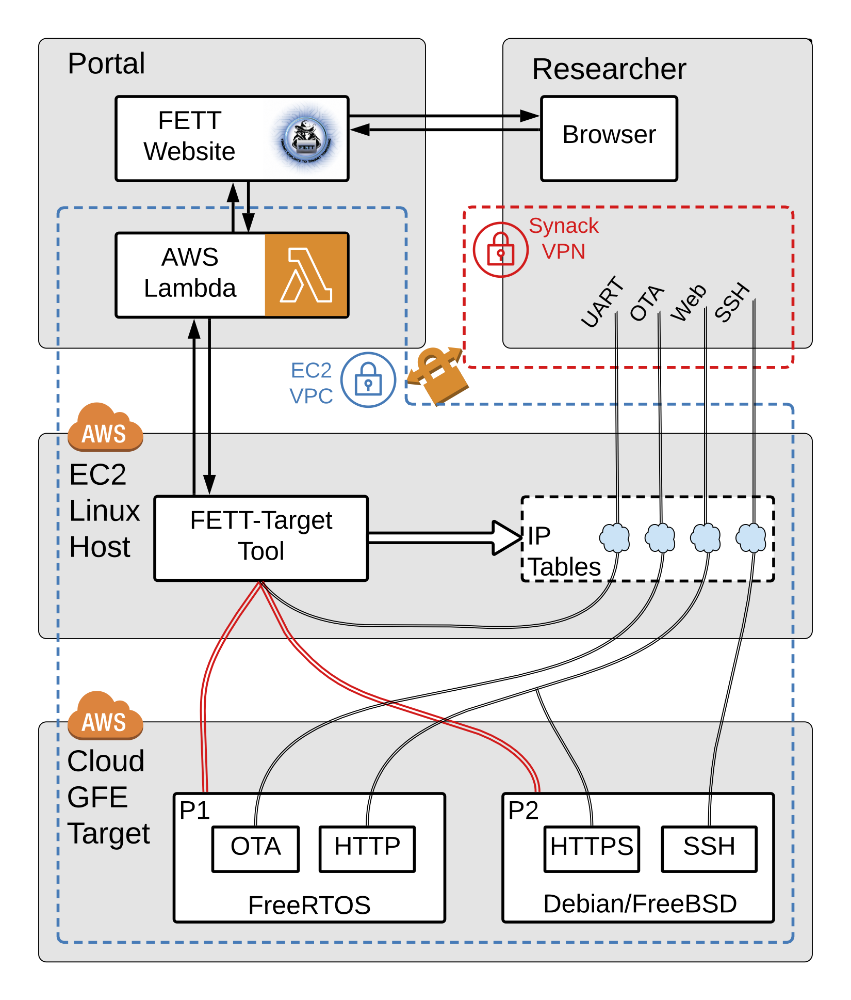
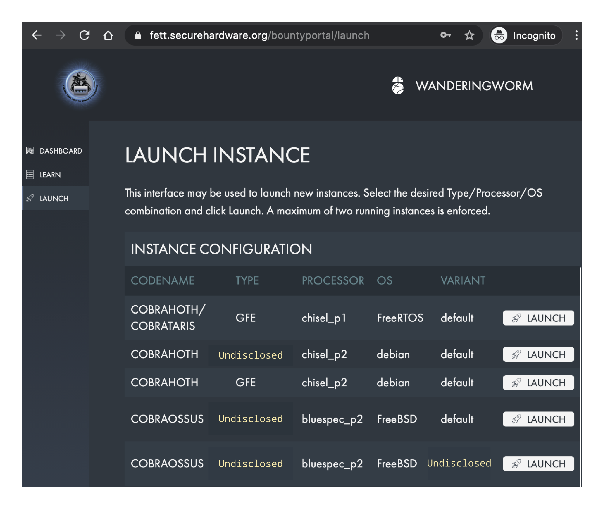
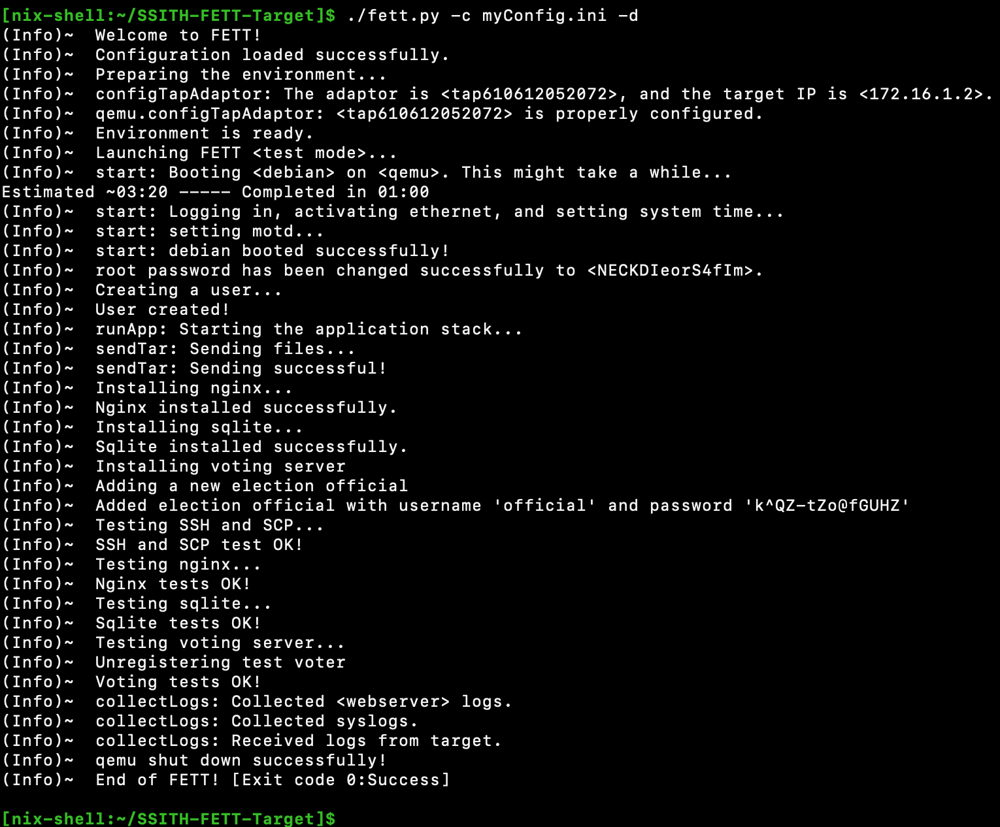

# DARPA FETT Bug Bounty 2020 #

DARPA held the Finding Exploits to Thwart Tampering ([FETT](https://fett.darpa.mil/)) bug bounty in summer 2020. This directory has the related documents and instructions.

The following paper was written about the details of the bug bounty and with a focus on the tool: *Daniel M. Zimmerman, Joseph R. Kiniry, Ramy N. Tadros, and Dylan Hand, “FETT: Deploying RISC-V Systems-on-Chip to the Cloud for Security Research,” GOMACTech 2021, Virtual, Mar. 2021.* This document should be updated with a link to the manuscript when the paper is published.

## Overview ## 

The figure below is an overview of the FETT system architecture for deployment on AWS.

A researcher can launch a target of their choice through the [FETT website](https://fett.securehardware.org/), then obtain an IP address through which they can access the available applications/attack surface on specific ports that connect them to a CloudGFE FPGA running on an EC2 F1 instance. A screenshot of a researcher dashboard is shown below:

## Summary of Contents ##

- [uartPiping.md](./uartPiping.md): Instructions of how to access the FPGA UART remotely from outside the host.

- [apps](./apps): Contains resources and details about the application stack and the deployment tests.

- [build](./build): Contains the instructions of how to reproduce the binaries used for the bug bounty.

- [design](./design): The design of the BESSPIN FETT Target System written in *Lando*.

## Tool's Modes of Operation ##

There are two modes that run very similarly: `fettTest` and `fettProduction`. The configuration details are described [below](#configuration). The tool's flow can abstractly be summarized as follows:
- *`fettProduction` mode only:* A host is instantiated through the portal upon a researcher's request and the tool is thus launched through a cloud-hook script.
- Prepare the needed binaries whether through building them (`fettTest` mode only) or selecting them from the LFS repo, the NIX package, or the artifactory based on the researcher chosen configuration.
- Set up the network as needed, which includes creating a tap adaptor in addition to the secondary IP setup and the NAT IP tables rules.
- Set up the FPGA. This includes the reloading of the necessary kernel modules for the FPGA SDK and flashing the FPGA with the chosen processor bitstream.
- Boot the OS. Note that the tool interacts with the booted OS through the UART (the double red lines in the figure). 
- Install any needed applications or services or scripts.
- Running the deployment tests: Since this is a research hardware environment with many *moving parts*, occasionally some components would not work as intended. Therefore, before handing over the instance to the researcher requesting it, we perform some tests to ensure the target OS is functional, its Ethernet adaptor is up, and the applications behave as intended.
- Setting up the logging and `rsyslog` for the Unix targets.
- *`fettProduction` mode only:* Open a TCP port and pipe the FPGA UART stream to it through the tool.
- *`fettProduction` mode only:* Send an SQS message to the FETT portal with the IP information to announce that the target is ready for the researcher to use. (Or send a failure message).
- *`fettProduction` mode only:* Waits for communication from the portal to either tell the tool to start the shutdown sequence, or tell it to reset the target. In case of the latter, the FPGA is re-flashed and the OS is rebooted while keeping everything else the same. This offers researchers a faster turnaround time than a complete shutdown and relaunch. When the shutdown sequence is invoked, it stores all possibly-useful artifacts in an S3 bucket for future inspection.
- *`fettProduction` mode only:* There is a watchdog that checks whether the main process (Firesim or Connectal) is still alive. If it becomes dead, the tool stops waiting and reports the death to the portal.
- *`fettProduction` mode only:* Collect the remote logs in addition to all logs and articats and store them in an S3 bucket for future inspection.
- The OS is shutdown and all processes are terminated.
- *`fettProduction` mode only:* Send an SQS message to the FETT portal to tell it that the instance is ready to be terminated.
- *`fettProduction` mode only:* The portal terminates the created instance and wipes its data.

## Configuration ##

When `mode` is set to `fettTest` or `fettProduction` in the `functionality` section, the following sections are loaded:    
- `target`: The target's settings as explained in [targets.md](../base/targets.md).
- `common`: The common settings as explained in [configuration.md](../base/configuration.md).
- `build`: The compiler/linker settings as explained in [configuration.md](../base/configuration.md). Only valid in `fettTest` mode when `buildApps` is enabled.
- `fett`: This is only loaded in the bug bounty modes, it has the following parameters:
    - `buildApps`: Only valid in `fettTest` mode. It is a boolean for whether to build the application binaries and the FreeRTOS binary, or fetch them from the tool's resources: the binaries LFS checkout, or the Nix package manager (see [nix.md](./nix.md) for more details).

## Example ## 

The following screenshot is based on a run of the baseline Qemu Debian image in `fettTest` mode.

As mentioned in this document, more information about the application stack can be found in the paper or in the [apps](./apps) or [build](./build) directories.
