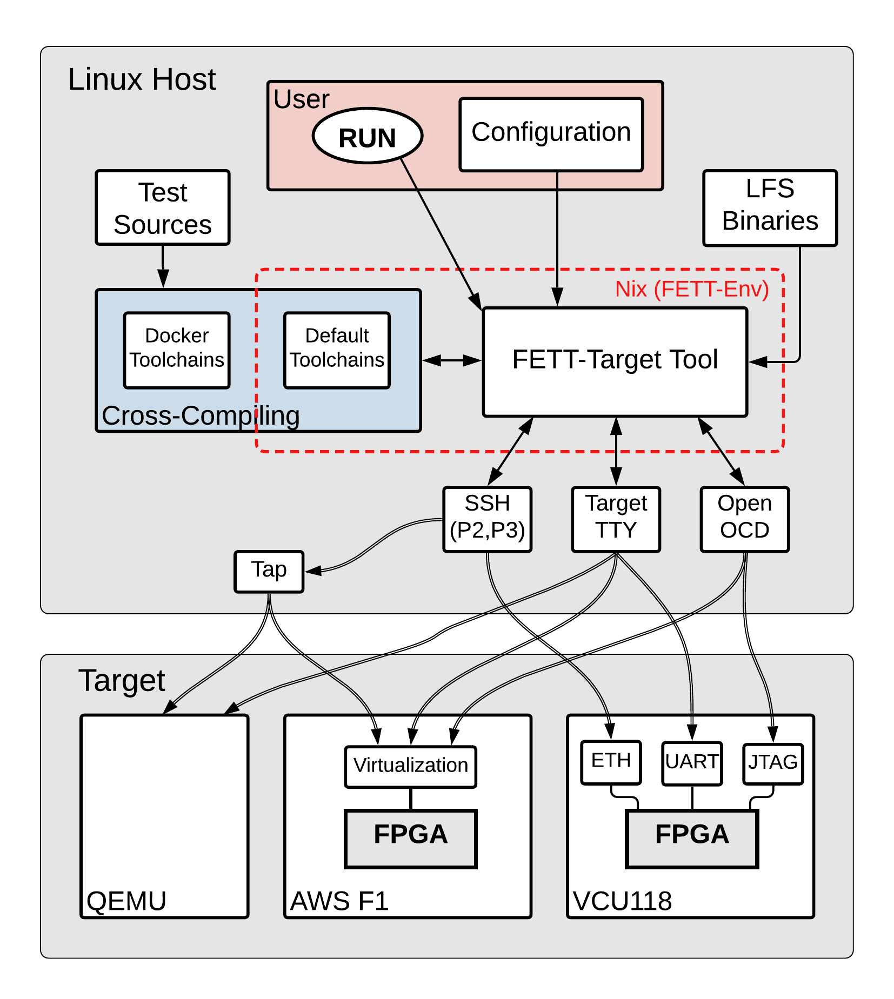
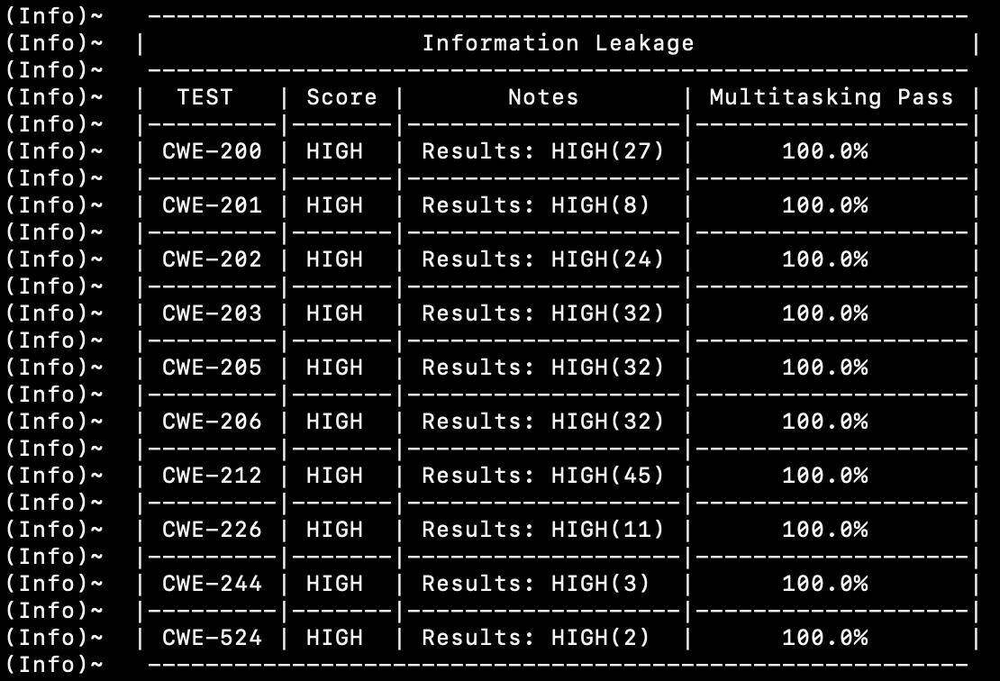
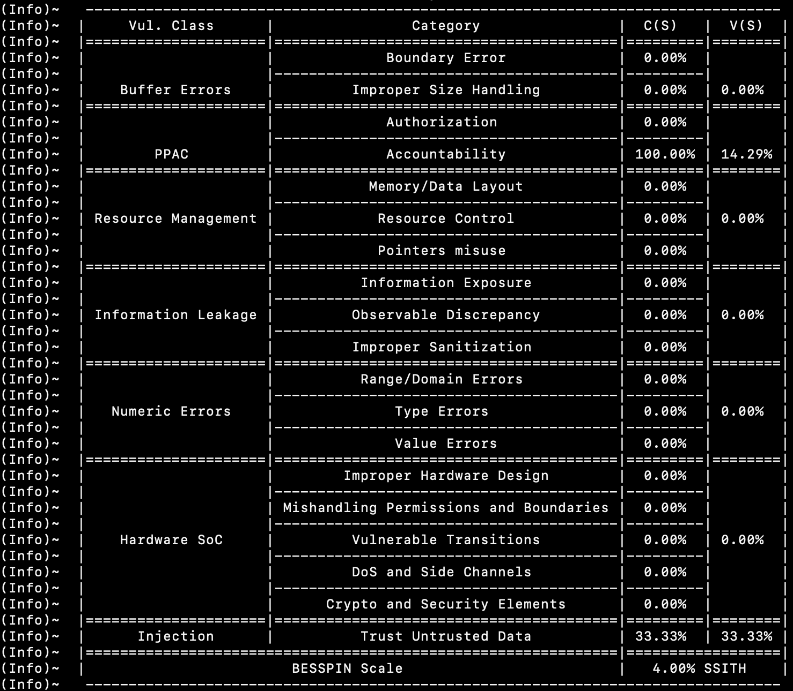

# Security Evaluation Platform #

This is the documentation for running the tool in the `evaluateSecurityTests` mode.

## Overview

A list of the vulnerability classes, and the NIST CWEs mapped to each class, appears in [ssithCWEsList.md](./ssithCWEsList.md).
A class-specific description is provided in each vulnerability class [directory](../../besspin/cwesEvaluation/).

The philosophy of the platform and the methodology of the testing are explained in detail in the [BESSPIN philosophy document](./besspinPhilosophy.md). For details about this tool's mode from the point of view of methodology and details rather than functionality, please check [modes.md](../base/modes.md).

The figure below is an overview of the tool when running in the CWEs evaluation mode.

The tool selects the tests to run based on the configuration; it cross-compiles them, runs them on the selected OS and backend, then scores the output, and displays the results.

Please note that this part of the tool-suite was originally called `testgen`; which might be useful in understanding parts of the git's history.

## Summary of Contents ##

- [BESSPIN-Coeffs.md](./BESSPIN-Coeffs.md): The values of the BESSPIN coefficients. This document is automatically generated based on the values in the [JSON file](../../besspin/cwesEvaluation/utils/besspinCoeffs.json). More explanation can be found in the BESSPIN Scale document (next).

- [BESSPIN-Scale.pdf](./BESSPIN-Scale.pdf): White paper explaining the BESSPIN Scale, which is the security figure of merit.

- [BESSPIN-Scale.tex](./BESSPIN-Scale.tex): The LaTex source of the BESSPIN-Scale pdf which gets compiled on [Overleaf](https://www.overleaf.com/). Please note that we use this unfortunately incompatible `git` format for the sake of displaying the mathematical formulas in a more readable way.

- [besspinPhilosophy.md](./besspinPhilosophy.md): As explained above, this explains the philosophy of the platform and the methodology of the testing.

- [configuration.md](./configuration.md): Detailed documentation of all the configuration options related to this mode of operation.

- [constrainBufferErrors.md](./constrainBufferErrors.md): Detailed explanation of the use of the configuration options concerning the use of a custom error model for buffer errors tests.

- [kernelModules.md](./constrainBufferErrors.md): How to cross-compile a kernel module for RISC-V Linux Debian. This flow has not been integrated with the tool, and there is no plan for doing that soon.

- [poc-exploits](./poc-exploits): This directory has some proof-of-concept exploits to some of the SSITH vulnerability classes.

- [ssithCWEsList.md](./ssithCWEsList.md): The full list of the CWEs and vulnerability classes supported by the SSITH program and the BESSPIN tool. This document is automatically generated based on a DARPA spreadsheet, and is compared against the various tool's parts using the [ssithCWEsList.py](../../utils/ssithCWEsList.py) utility.

## Tool's Mode of Operation ##

When the tool is configured to run in the `evaluateSecurityTests` mode, it runs the CWEs tests on the selected target/OS. This also loads the configuration of the `evaluateSecurityTests` section, and optionally other sections. The configuration details are provided in [configuration.md](./configuration.md).

The tool's flow can abstractly be summarized as follows:
- Select the tests to run based on CWEs selection in the configuration.
- Cross-compile the C files based on the configured compilation method.
- Launch the OS on the selected target.
- Execute the tests.
- Collect the logs (tests' output in addition to kernel messages if any).
- Score the logs based on the configured scoring details.

The tool's outputs are:
- Stdout: A table listing the score of each CWE grouped by vulnerability class, and a table with the BESSPIN scale details.
- `scores.csv`: A `csv` file for each vulnerability class located in `${workDir}/cwesEvaluation/${vulClass}/`.
- `scoreReport.log` (and `multitaskingScoreReport.log` if enabled): Log files containing the same tables printed on the stdout.

## Example ##

The following screenshots are based on a run of the baseline Qemu Debian image, with all tests enabled, and with default compilation and scoring. 

The following table is the information leakage score. It is of no surprise that the baseline emulation does not protect against any of these CWEs. Also note that the multitasking was running, and a `PASS` means that the score of the multitasking matches the score of the single test run.

The BESSPIN Scale table looks like the following. An all-CWEs run will get a single figure of merit where a value of 100% means an ideal SSITH processor. It might be counter-intuitive that the baseline emulation did not score 0%, but the basic Linux Debian enforces a few proper security practices, such as logging any supervisor message to a privileged location for example.

