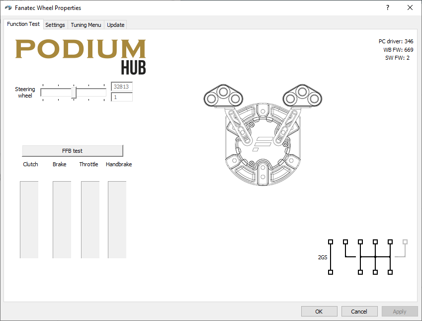
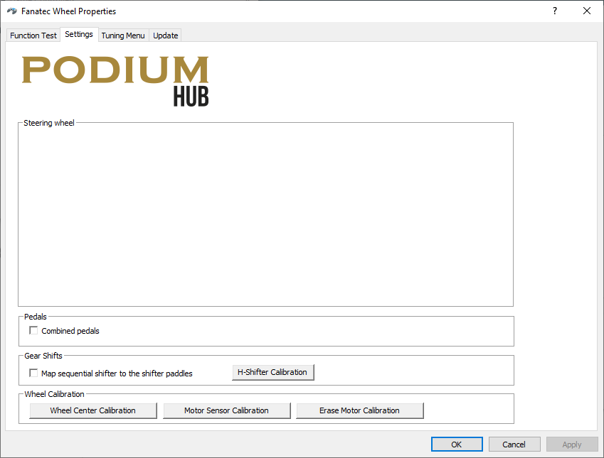
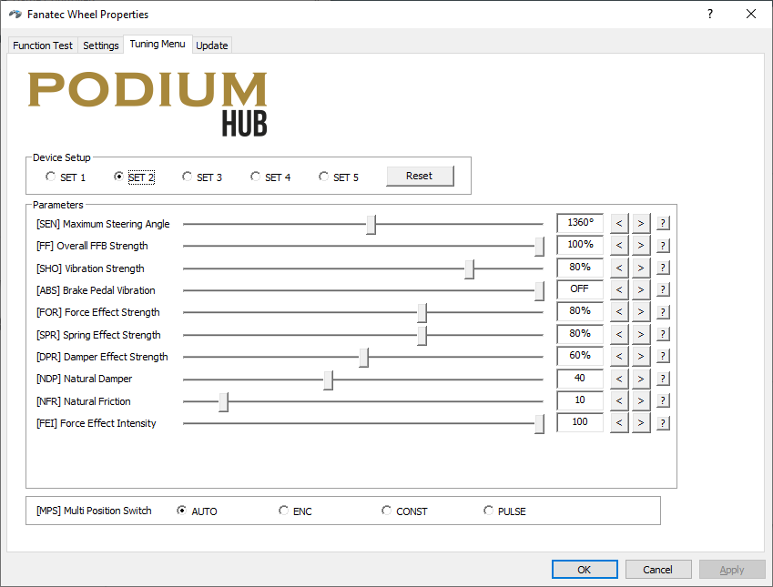
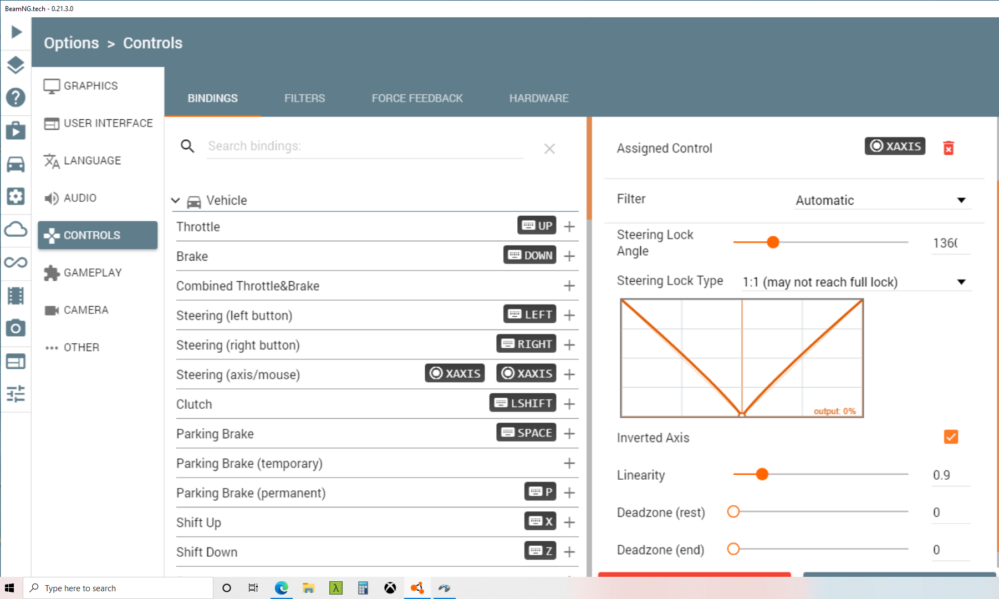
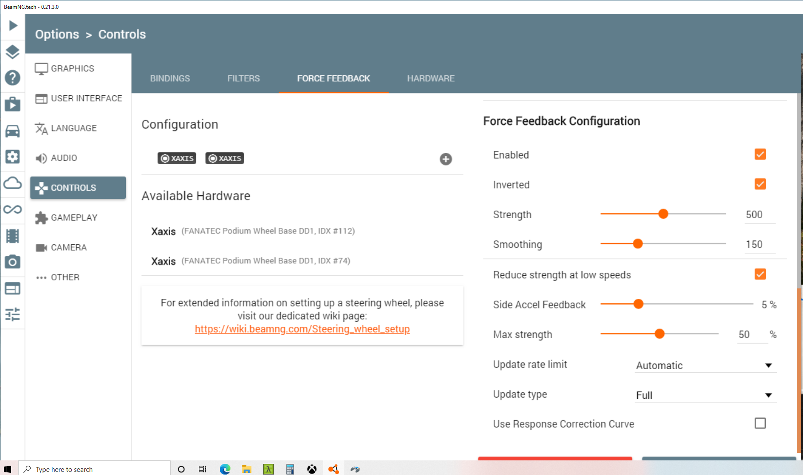

# Steering Calibration

## Fanatec Driver configuration

Launch the Fanatec driver calibration app.

##### Function Test
The function test menu is just to ensure the wheel is functioning.  Since
we are not using the other Fanatec accessories like pedals there is not a lot
to test here.  Just move the wheel left and right and observe the change in 
steering angle.

#### Calibration Menu
Under the settings menu the key functionality that you'll want to be aware of 
is the **Wheel Center Calibration** capability.  If the steering is off center
while driving for any reason just visit this menu, center the steering, and
press the Wheel Center Calibation button to set the center point.

#### Tuning Menu
There are multiple presets you can choose from.  We are currently using *SET 2*
and making modifications as needed to that preset.  The key variable here when
adjusting how much the wheel turns is the maximum steering angle.  We have set 
this to 1360 degrees as it provides tight responsive steering.

# Beam configuration

It's important that the settings in Beam are configured and in-line with the
Fanatec driver settings.  There are also additional steps needed here to enable
and tune force-feedback.

### Steering configuration
Under steering configuration we want to match the steering lock angle to the 
maximum steering angle we set in the Fanatec tuning menu.  Currently we're using
1360 degrees.

Be sure to set the "Steering Lock type" to "1:1 (may not reach full lock)".

Adjusting the linearity down provides for a snappier driving car at low speeds,
but can make the car harder to control at high speed.  We're using a setting of
0.9.

Our setup requires the steering axis to be inverted.

### Force feedback configuration
Ensure force feedback is enabled and the axis is inverted.
Turn the feedback strength up.  500 seems to be a happy spot where the feedback
is noticeable and the steering recenters easily without being stiff.

Ensure the "reduce strength at low speeds" box is checked or the steering is 
going to be a bear to move at low speeds.

Also ensure the other settings such as max strength (50%),
Side Accel Feedback (5%), Update rate, update Type, are sane values similar to
the ones pictured.

