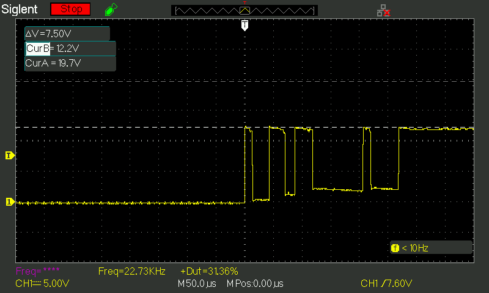
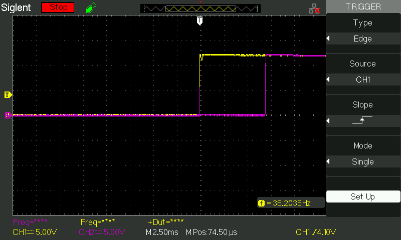
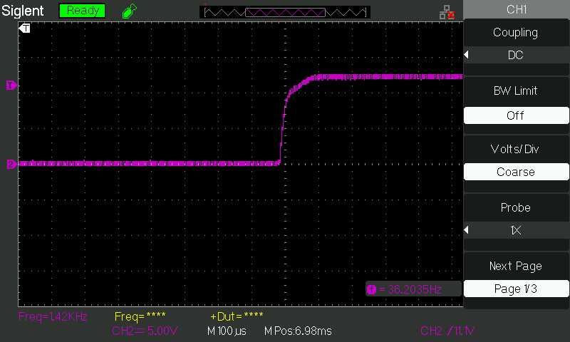

# Introduction
This printed circuit board assembly eliminates the effects of relay contact debounce on an attached load by delaying start up on its output voltage by 6.5 milliseconds (typical) from the most recent valid increasing voltage rising above 10.8 volts DC. The board was designed in Eagle Premium version 9.6.2.

# Design Files
- Schematic: RELAY CONTACT BOUNCE ELIMINATOR_REV 2.sch
- Schematic (pdf): RELAY CONTACT BOUNCE ELIMINATOR_REV 2.pdf
- PCB Layout: RELAY CONTACT BOUNCE ELIMINATOR_REV 2.brd
- Gerber Files: RELAY CONTACT BOUNCE ELIMINATOR_REV 2_2021-01-19.zip
- Parts list: RELAY CONTACT BOUNCE ELIMINATOR_REV 2_parts.csv

# Theory of Operation
The TPS3847108 monitors VCC. When it senses a voltage above 10.8 volts, it starts a countdown timer. When that timer expires, !RST goes high and drives the control input to an automotive-grade smart switch, ITS428L2. The smart switch turns an internal N-channel MOSFET on to connect the board's VIN to VOUT.

# Waveforms
The following waveform shows typical relay contact bounce when the relay is turned on with a load directly attached to its normally open (NO) pin.

The following waveform shows initial instability during turn of the relay on and a delay of ~6.5 milliseconds between the time VIN (yellow) is applied and VOUT (magenta) is turned on.

The following waveform shows a clean, fast turn on of VOUT (magenta) which is applied to the LED strings on a terminal block. The "fuzz" is due to zooming in on the signal, not due to a noisy 12 volt supply.

